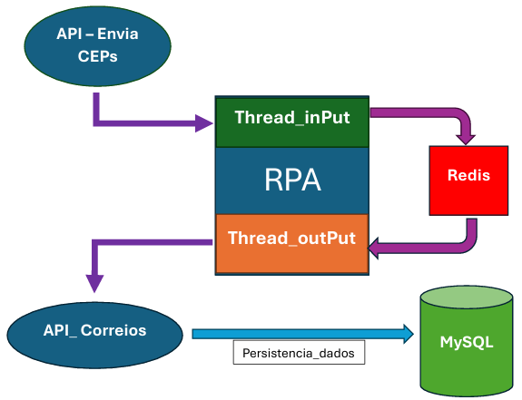

# Automação RPA com Threads Python e banco de dados REdis e MySQL

Este Projeto é um exemplo de uma aplicação RPA que utiliza Redis para gerenciamento de filas, MySQL para armazenamento de dados e APIs para buscar informações de CEPs. Ele também utiliza threading para realizar tarefas simultaneamente.

## Fluxo da Automação

Uma API - Python ao adicionar um CEP utilizando o método POST, salva o mesmo em um arquivo txt e aciona o Robô principal;

O Robô principal escrito em Python, possui duas threads que irão trabalhar de forma coordenada e simultânea(programação concorrente) utilizando filas no banco de dados NoSQL Redis;

1° thread: insere o cep na fila do Redis;
2° thread: processa o dado(CEP) e exclui da fila Redis, acessa a API dos correios e recupera os dados de localização, onde serão armazenados no banco de dados relacional MySQL;

## Tecnologias

- Projeto criado em ambiente Linux(Ubuntu 18.04)
- API e Automação escritos em linguagem Python
- Armazenamento e processamento no banco de dados Redis
- Persistência de todos os dados no banco de dados MySQL
